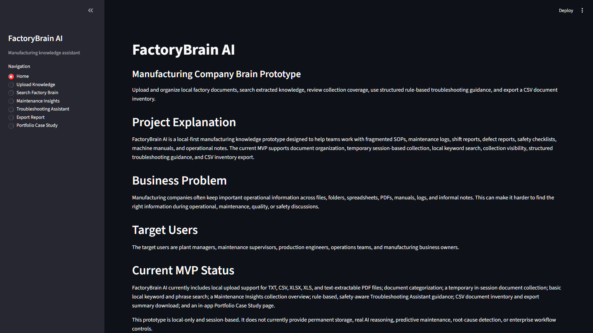
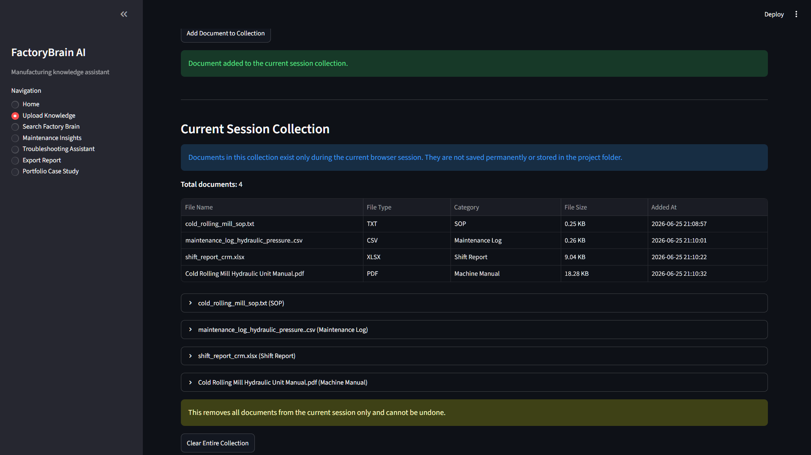
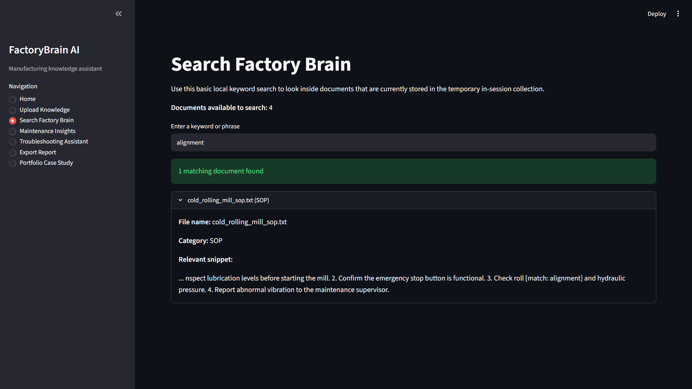
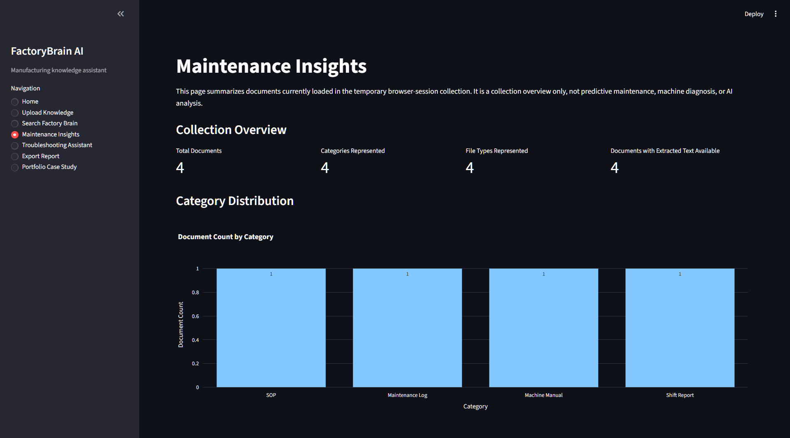
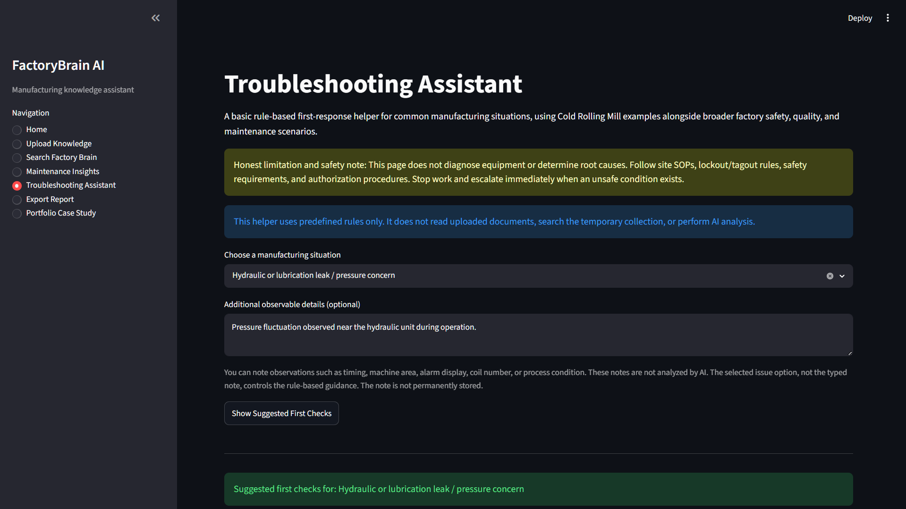
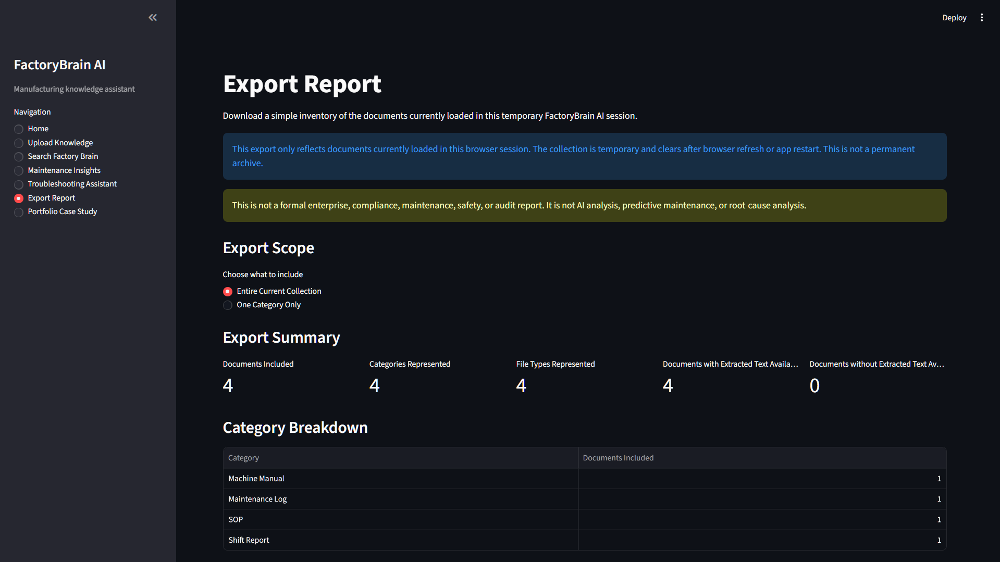
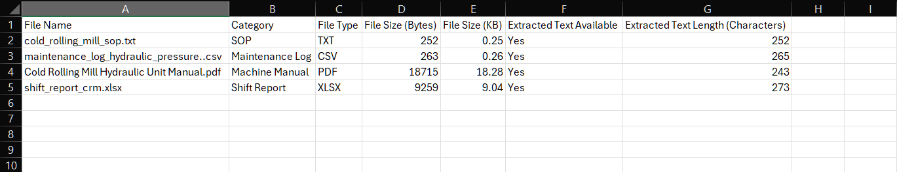
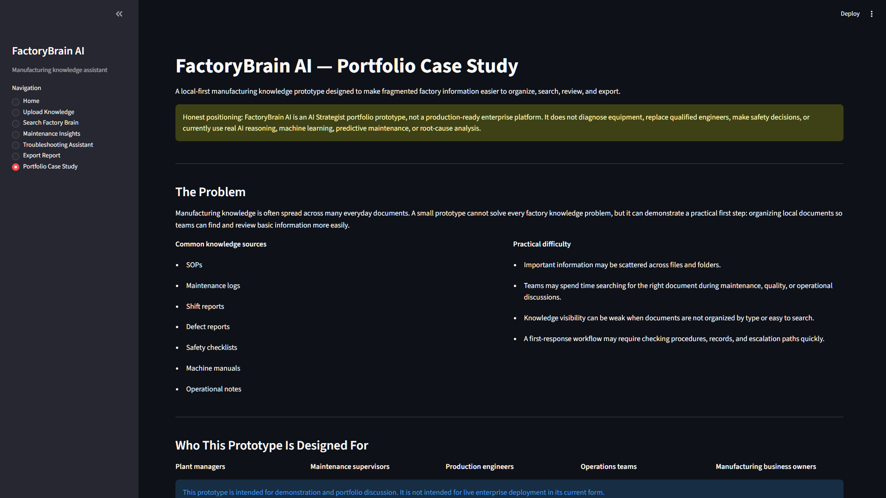

# FactoryBrain AI — A Local-First Manufacturing Knowledge-Support Portfolio MVP

FactoryBrain AI is a local-first Streamlit portfolio MVP that shows how a manufacturing team could organize, search, review, and export local operational knowledge during a temporary app session.

## Project Status

FactoryBrain AI is an AI Strategist portfolio prototype built to demonstrate product thinking for manufacturing operations. It is not a production-ready enterprise platform, not a deployed customer system, and not a replacement for qualified engineering judgment or approved site procedures.

The current MVP is intentionally limited. It focuses on a clear local-first workflow instead of APIs, databases, machine learning, chatbots, or enterprise integrations.

## Manufacturing Problem

Manufacturing knowledge is often spread across many everyday documents and file types:

- SOPs
- Maintenance logs
- Shift reports
- Defect reports
- Safety checklists
- Machine manuals
- Operational notes

When this information is fragmented, plant teams may spend extra time finding the right document during maintenance, quality, safety, or production discussions. FactoryBrain AI explores a practical first step: collect local documents temporarily, categorize them, search extracted text, review collection coverage, and export a simple inventory for follow-up.

## Intended Users

- Plant managers
- Maintenance supervisors
- Production engineers
- Operations teams
- Manufacturing business owners

## Current MVP Capabilities

The current app supports:

- Uploading and categorizing local `TXT`, `CSV`, `XLSX`, `XLS`, and text-extractable `PDF` documents
- Temporary in-session document collection
- Local keyword and phrase search over extracted text
- Maintenance Insights collection coverage overview
- Rule-based Troubleshooting Assistant Version 1
- CSV document inventory and export summary downloads
- In-app Portfolio Case Study page

## How The Workflow Works

1. Upload a local manufacturing document.
2. Choose a document category such as SOP, Maintenance Log, Shift Report, Defect Report, Safety Checklist, Machine Manual, or Other.
3. Add the document to the temporary current-session collection.
4. Search extracted text with a simple keyword or phrase.
5. Review Maintenance Insights to understand collection coverage and represented categories.
6. Use the Troubleshooting Assistant for predefined first-response guidance on common manufacturing situations.
7. Download CSV inventory and summary files for review or handover.

## Product Walkthrough Screenshots

















**Sample data note:** The example documents and screenshots use illustrative, non-production materials created for portfolio demonstration purposes.

## Technology Stack

| Area | Confirmed technology |
| --- | --- |
| Programming language | Python |
| App framework | Streamlit |
| Data handling | pandas |
| Excel support | openpyxl, xlrd |
| PDF text extraction | PyMuPDF |
| Charts | Plotly |
| Local session state | Streamlit session state |
| CSV export | pandas CSV output through Streamlit download buttons |

`requirements.txt` also currently includes `scikit-learn`, but the current app does not claim machine learning, predictive maintenance, AI reasoning, or model-based analysis.

## Local Setup And Run Instructions

Prerequisite: Python 3.14.6, or the installed project-compatible Python version.

Clone or download the repository, then open a terminal in the project folder.

Optional: create and activate a virtual environment on Windows PowerShell:

```bash
python -m venv .venv
.\.venv\Scripts\Activate.ps1
```

Install the required packages:

```bash
pip install -r requirements.txt
```

Run the Streamlit app:

```bash
python -m streamlit run app.py
```

## Current Limitations And Deliberate Boundaries

This prototype is deliberately limited:

- It is local-only and session-based.
- It does not permanently store uploaded documents.
- It does not provide real AI reasoning.
- It does not use RAG, embeddings, vector databases, APIs, or chatbots.
- It does not diagnose equipment or identify root causes.
- It does not provide predictive maintenance, machine-health scoring, or failure prediction.
- It does not automatically interpret uploaded documents or make automatic recommendations.
- It does not provide enterprise authentication, access control, audit trails, approval workflows, compliance records, or deployment claims.

The search feature is basic keyword and phrase matching. PDF extraction depends on whether the PDF contains extractable text. CSV and Excel handling is intentionally simple.

## Responsible AI And Safety Positioning

The Troubleshooting Assistant is a predefined rule-based first-response helper. It supports safe, structured thinking by showing immediate safe actions, authorized first checks, escalation guidance, and suggested search keywords.

It does not replace qualified engineers, approved site procedures, lockout/tagout requirements, safety controls, supervisor review, or site-specific maintenance and quality processes. Any real operational use would require qualified human review, factory-specific procedure design, and safety approval.

## Potential Future Roadmap

These are possible future exploration areas, not current functionality and not promises:

- Improve file validation and clearer extraction feedback.
- Improve filtering and search usability.
- Add more rule-based manufacturing scenarios.
- Add richer document inventory reporting.
- Explore durable local storage only after the session-based workflow is stable.
- Explore better document indexing with clear source visibility.
- Explore controlled, cited AI-assisted retrieval with human review requirements.
- Consider enterprise readiness topics such as access control, governance, audit trails, and approval workflows only as later design considerations.

## What This Project Demonstrates

FactoryBrain AI demonstrates:

- Manufacturing problem framing
- AI Strategist product thinking
- Local-first MVP scoping
- Safety-aware workflow design
- Responsible AI positioning
- User-focused operational workflow design

The project is meant to show how an AI Strategist can define a practical business problem, scope an honest MVP, avoid overclaiming AI capability, and design a workflow around real operational needs.

## Author Note

FactoryBrain AI was built by Ayan Goswami as an AI Strategist portfolio project focused on manufacturing operations.
